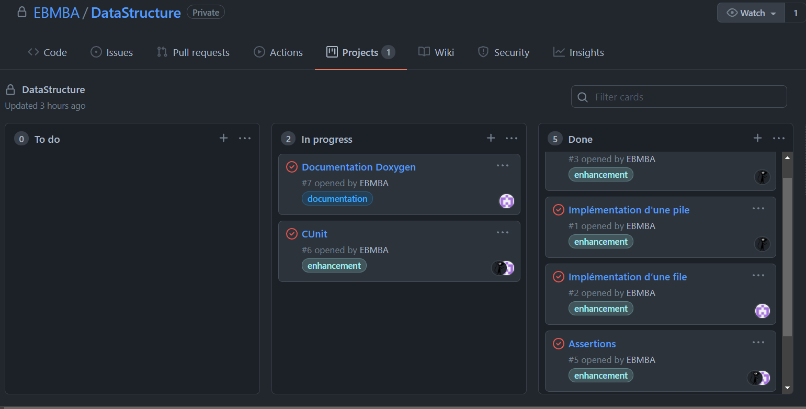

# DataStructure
## Auteur : Kubilay Kaplan et Emile Metral

# But du TP
Dans ce Tp nous allons implémenter 4 algorithmes permettant de manipuler des piles, des files, listes et tas.
# Documentation
Le code est documenté, il est commenté et annoté au format Doxygen. La documentation technique peut être extraite grace à une commande contenu dans le Makefile.

Commande pour generer la documentation : `make documentation`

Commande pour utiliser le programme : `./output/main`

Nous avons fait en sorte que le `make clean` supprime le dossier générer pour la documentation Doxygen.

# Gestion de projet
Pour la gestion du projet nous avons utilisé la méthode agile pour nous fixé des objectifs à court terme et ainsi être plus performant.

